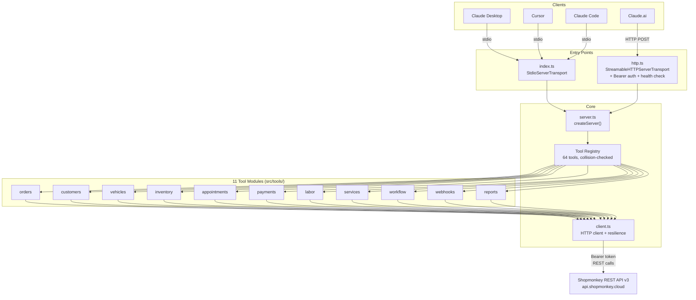

# Architecture

The Shopmonkey MCP server is a TypeScript application that exposes the [Shopmonkey REST API (v3)](https://shopmonkey.dev/overview) through the [Model Context Protocol](https://modelcontextprotocol.io), enabling AI agents and LLMs to interact with shop management data using structured tool calls.

## Technology Stack

- **TypeScript 5.8+** with strict mode
- **Node.js 18+** (ESM with Node16 module resolution)
- **[@modelcontextprotocol/sdk](https://www.npmjs.com/package/@modelcontextprotocol/sdk)** — MCP server framework
- **dotenv** — environment variable loading
- **node:test** — built-in test runner (no external test framework)

## System Overview



## Dual Transport Architecture

The server supports two transports from a single codebase, sharing one tool registry:

### stdio (local use)

`src/index.ts` — A minimal 16-line bootstrap that imports `createServer()` and connects it to `StdioServerTransport`. Used by Claude Desktop, Cursor, Claude Code, and other local MCP clients. The MCP client spawns this process directly.

### Streamable HTTP (cloud deployment)

`src/http.ts` — A Node.js HTTP server that delegates MCP requests to `StreamableHTTPServerTransport`. Designed for Railway, Render, or any cloud host. Includes:

- **Bearer token authentication** via `MCP_AUTH_TOKEN` environment variable (open access when unset for local development)
- **Health check** at `GET /health` and `GET /` returning `{"status":"ok"}` for load balancer probes
- **Graceful shutdown** on SIGTERM/SIGINT with a 5-second force-kill timeout

### Shared Server (`createServer()`)

`src/server.ts` is the transport-agnostic core. It:

1. Imports all 11 tool modules
2. Flattens their `definitions` arrays into a master tool list
3. Merges their `handlers` maps with collision detection
4. Creates an MCP `Server` instance with `ListTools` and `CallTool` request handlers
5. Returns the server for the caller to connect to any transport

This design means tool registration code exists in exactly one place. Adding a new tool module requires only adding an import and pushing it into the `toolModules` array.

## Tool Module Pattern

Every tool module in `src/tools/` exports two constants:

```typescript
export const definitions: Tool[] = [/* MCP tool definitions */];
export const handlers: ToolHandlerMap = {/* tool name → async handler */};
```

**Handler contract:**
- Signature: `async (args: Record<string, unknown>) => Promise<ToolResponse>`
- Handlers **throw** on errors — the registry's `CallToolRequest` handler catches and wraps them as `{ isError: true }` responses
- Successful responses return `{ content: [{ type: 'text', text: JSON.stringify(data, null, 2) }] }`

**Security patterns:**
- **`pickFields(args, allowedFields)`** — Whitelist body construction. Never spread `args` directly into API request bodies. Preserves falsy values (0, false, empty string).
- **`sanitizePathParam(value)`** — Wraps path parameters in `encodeURIComponent()` before string interpolation to prevent injection.
- **Required-arg validation** — `if (!args.id) return { isError: true, ... }` pattern for required parameters.

## HTTP Client (`client.ts`)

The centralized HTTP client provides resilience for all Shopmonkey API calls:

| Feature | Implementation |
|---------|---------------|
| **Authentication** | Bearer token via `SHOPMONKEY_API_KEY` environment variable |
| **Base URL** | `SHOPMONKEY_BASE_URL` (default: `https://api.shopmonkey.cloud/v3`) |
| **Retry** | Up to 3 attempts on HTTP 429, 500, 502, 503, 504 |
| **Backoff** | Exponential backoff, respects `Retry-After` header |
| **Concurrency** | Max 5 simultaneous requests via semaphore queue |
| **Timeout** | 30-second `AbortController` per request |
| **Rate limiting** | Descriptive error message with retry-after value on 429 exhaustion |
| **Error surfaces** | Shopmonkey error codes (`API-xxxxx`, `ORM-xxxxx`) and `message` field propagated to the LLM |

## Error Propagation

```
Tool handler throws → server.ts CallTool catch → { isError: true, text: "Error: ..." } → MCP client
```

The error flow is intentionally simple:
1. `client.ts` parses the Shopmonkey API response and throws an `Error` with the API's `code` and `message` fields
2. Tool handlers do **not** catch — they let errors propagate
3. `server.ts` catches in the `CallToolRequest` handler and wraps as an MCP error response
4. The MCP client (Claude, Cursor, etc.) receives a structured error it can reason about

## Testing Architecture

- **9 test files** covering mock-API, protocol, error paths, and transport
- Tests run against compiled JavaScript: `npm run build && npm test` (`node --test dist/tests/*.test.js`)
- Mock API tests use `globalThis.fetch` monkey-patching — no HTTP server needed
- Protocol test (`mcp-protocol.test.ts`) spawns the actual built binary for integration-level verification
- HTTP transport test (`http-transport.test.ts`) spawns `dist/http.js` on an OS-assigned port

## Directory Structure

```
shopmonkey-mcp-server/
├── src/
│   ├── index.ts              # stdio entry point
│   ├── http.ts               # HTTP entry point (auth, health, shutdown)
│   ├── server.ts             # Shared server factory (createServer)
│   ├── client.ts             # Shopmonkey API HTTP client
│   ├── types/
│   │   ├── shopmonkey.ts     # API response types + entity interfaces
│   │   └── tools.ts          # Tool handler types + pickFields utility
│   ├── tools/
│   │   ├── orders.ts         # 4 tools
│   │   ├── customers.ts      # 6 tools
│   │   ├── vehicles.ts       # 7 tools
│   │   ├── inventory.ts      # 4 tools
│   │   ├── appointments.ts   # 4 tools
│   │   ├── payments.ts       # 3 tools
│   │   ├── labor.ts          # 4 tools
│   │   ├── services.ts       # 22 tools
│   │   ├── workflow.ts       # 2 tools
│   │   ├── webhooks.ts       # 5 tools
│   │   └── reports.ts        # 3 tools
│   └── tests/
│       ├── mock-api.test.ts
│       ├── tools.test.ts
│       ├── error-paths.test.ts
│       ├── mcp-protocol.test.ts
│       ├── canned-service.test.ts
│       ├── webhook.test.ts
│       ├── reports.test.ts
│       ├── http-transport.test.ts
│       └── client.test.ts
├── docs/                     # Client & community documentation
├── dist/                     # Compiled JavaScript (gitignored)
├── .github/workflows/ci.yml  # Build + test on push/PR
├── package.json
├── tsconfig.json
└── README.md
```
